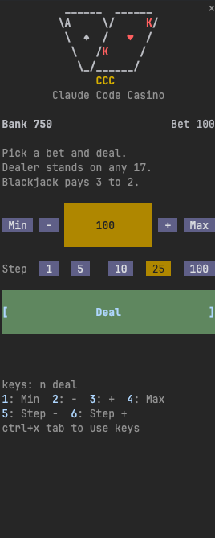
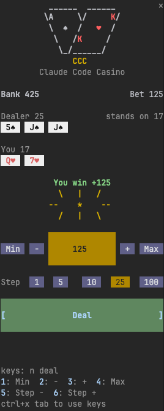
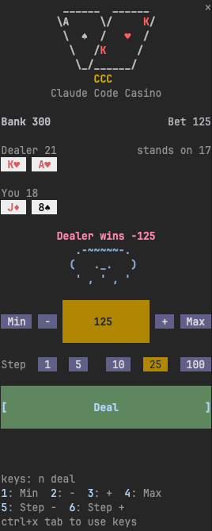

# Claude Code Blackjack

An unofficial [Claude Code mod](https://code.claude.com/docs/en/plugins/mods/overview) that opens a blackjack table beside the conversation, so you have something to do while Claude works. It tells you when Claude is done, so you know when to get back to work.


> [!IMPORTANT]
> **Fullscreen mode is highly recommended.** It gives the table a sidebar, mouse clicks, card art and animations. Run `/tui fullscreen` once, or start a single session with `CLAUDE_CODE_NO_FLICKER=1 claude`.
>
> The default layout works too: there the table is a compact, keyboard-only strip above the prompt.

## Screenshots

<p>
  
  
  
</p>

## Install

You need Claude Code 2.1.287 or later, with mods available to your account. See [Check whether mods can load](https://code.claude.com/docs/en/plugins/mods/troubleshoot#check-whether-mods-can-load).

From your shell:

```sh
claude plugin marketplace add michaeldavodovski/claude-code-blackjack
claude plugin install blackjack@claude-code-blackjack
```

To update later, run `claude plugin update blackjack@claude-code-blackjack`. Updates are not automatic by default: to get them without asking, open `/plugin`, go to Marketplaces, select `claude-code-blackjack` and choose "Enable auto-update".

To try it for one session without installing:

```sh
git clone https://github.com/michaeldavodovski/claude-code-blackjack
claude --plugin-dir ./claude-code-blackjack
```

## Play

The table opens by itself once you send Claude a prompt and it starts working (in the fullscreen layout), or you can open and close it yourself at any time with `/blackjack`.

| | Fullscreen (recommended) | Default layout |
| --- | --- | --- |
| Where | A sidebar on the right, in a terminal at least 110 columns wide | Four rows above the prompt |
| Opens | By itself when Claude starts working, or with `/blackjack` | With `/blackjack` only |
| Controls | Mouse clicks, or keys | Keys only, each shown beside its action |

- `/blackjack` also gives the table the keyboard.
- To use the keys otherwise, give the pane the keyboard with ctrl+x, then tab. Esc returns to the prompt.
- Closing the table by hand keeps it closed until you run `/blackjack` again.

Between hands, minus and plus change your bet by the amount shown on them. The "Bet change step" row picks that amount (1, 5, 10, 25 or 100). Min bets one chip and Max goes all in.

Rules: six decks, the dealer stands on any 17, blackjack pays 3 to 2 (rounded down to whole chips), double on your first two cards. No split, insurance or surrender. You start with 1000 chips and can rebuy when you run out.

## Settings

Both are rows in `/config`.

| Setting | Values | Default | What it does |
| --- | --- | --- | --- |
| Open automatically | on, off | on | Opens the table when Claude starts working (fullscreen only). Off: it opens only with `/blackjack`. |
| Theme | dark, light | dark | The table's colors, for a dark or a light terminal. |

## Notes

- **Your bank is one file.** It is saved under `~/.claude/plugins/store/` and shared by every session on the machine, along with your bet and step. Two sessions playing at once both count, unless two hands settle in the same instant.
- **Play chips only.** There is no real money and nothing to buy.
- **Early access API.** Mods can change between Claude Code releases, so an update may break this one. Tested with Claude Code 2.1.287 on macOS in the JetBrains terminal. The light theme and the default layout have had little use.
- **Platforms.** Nothing in the mod is specific to an operating system, so it should work wherever Claude Code mods do, Linux and Windows included, but it has only been run on macOS. It also draws in the Code tab of the Claude desktop app, with that app's own buttons. It does not load in a WSL session of the desktop app, and the VS Code extension's chat panel shows no mod panes.
- **Unofficial.** This project is not affiliated with or endorsed by Anthropic.

## License

[MIT](LICENSE)
